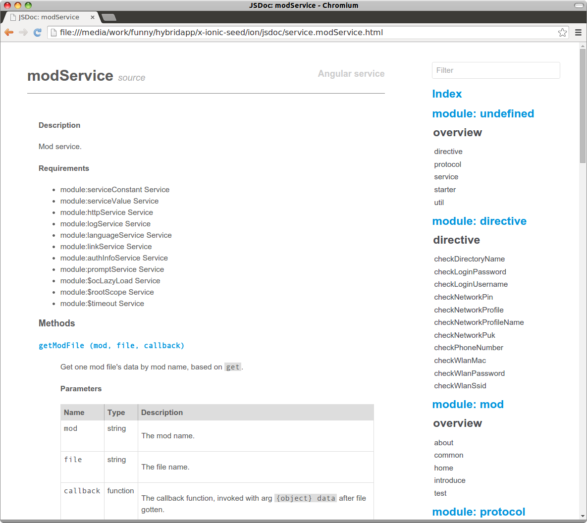

# x-ionic-seed

## Description

The perfect starting point for an [**Ionic**](http://ionicframework.com/) project (integrated with [**Angular**](https://angularjs.org/) and [**Cordova**](http://cordova.apache.org/)) with preseted features, e.g. modularized, load-on-fly, i18n, jsdoc, unit-testing and more...

 
 

Read [design doc](./docs/Design.md) if you care about how it work.

## Libs list

The project collects many great AngularJS libs, Cordova plugins, and has been customized to make your *HybridApp* development easier, quicker and more standard. They are

- Cordova plugin: Refer to [package.json](./ion/package.json): `cordovaPlugins` and [plugins/fetch.json](./ion/plugins/fetch.json)
- Angular js: Refer to [bower.json](./ion/bower.json): `dependencies`
- General js: Refer to [package.json](./ion/package.json) and [bower.json](./ion/bower.json): `dependencies`  and `devDependencies`

**Best practice**

- Use `bower` to install `dependencies` (for release, controlled by git)
- Use `npm` to install `devDependencies` (for debug, ignored by git)

## Installation

### Dependences

Any ionic or cordova project should prepare these tools below

- Install [Node.js](https://nodejs.org/en/download/releases/) 4.x.
- Install JDK7 (OpenJDK or SunJDK), Android SDK (Android Studio) or iOS SDK (Xcode).
  Refer to [Cordova docs](http://cordova.apache.org/docs/en/latest/) 7.x.

### Install now

- `git clone https://github.com/xfally/x-ionic-seed`
- `cd x-ionic-seed/ion && ./install.sh`

> Tip: Read [install.sh](./ion/install.sh) for more detail.

## Usage

When installed, the App is ready to build and run.

You can run any [ionic](https://github.com/driftyco/ionic-cli) or [cordova](http://cordova.apache.org/docs/en/4.0.0/guide/cli/index.html) cli (cmds), or any tasks defined in [gulpfile](./ion/gulpfile.js).

**Test**

- `gulp lint`: Run jshint.
- `gulp test`: Run unit-testing once.
- `gulp tdd`: Run unit-testing continuous.

**Jsdoc**

- `gulp jsdoc`: Generate jsdoc.

You can find all available service APIs in [jsdoc](./ion/jsdoc/).



**Default task** (recommended)

- `gulp`: The default task will run `lint`, `test` and `jsdoc`.

```sh
$ gulp
[14:11:43] Using gulpfile gulpfile.js
[14:11:43] Starting 'lint'...
[14:11:43] Starting 'test'...
[14:11:43] Starting 'jsdoc'...
06 09 2016 14:11:43.634:INFO [karma]: Karma v1.2.0 server started at http://localhost:9876/
06 09 2016 14:11:43.635:INFO [launcher]: Launching browser Chromium with unlimited concurrency
06 09 2016 14:11:43.642:INFO [launcher]: Starting browser Chromium
[14:11:44] Finished 'lint' after 994 ms
06 09 2016 14:11:45.090:INFO [Chromium 37.0.2062 (Ubuntu 0.0.0)]: Connected on socket /#6Yq4rrBZ67WfeinGAAAA with id 57939687
Chromium 37.0.2062 (Ubuntu 0.0.0): Executed 6 of 6 SUCCESS (0.005 secs / 0.11 secs)
[14:11:46] Finished 'jsdoc' after 2.59 s
[14:11:46] Finished 'test' after 2.94 s
[14:11:46] Starting 'default'...
[14:11:46] Finished 'default' after 6.41 μs
```

**Build & Run!**

Then build && run

```sh
# for web
ionic serve
# for ios
ionic build ios
ionic emulate ios
ionic run --device ios
# for android
ionic build android
ionic emulate android
ionic run --device android
```

> Tip: `ionic build` includes `ionic prepare` and `ionic compile`.

But the **recommended** build method is

1. Do `ionic prepare` in your shell.
2. Then import *platforms/android/build.gradle* to your Android Stuido, or *platform/ios/xxx.xcodeproj* to your Xcode. (Now you will have a chance to modify codes temporarily, which will be discarded when you run next `ionic prepare`)

## Todo

- Add (nodejs) server demo.

## License

MIT
