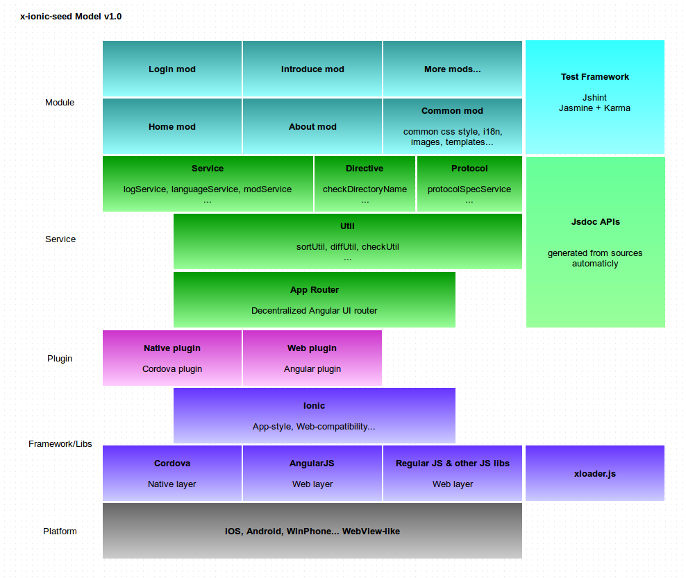

# x-ionic-seed Design

## Model

The App Model design:



## Module

Every Module (Mod) is like blow:

```sh
mod/test
├── entry.json    # mod entry (config) file
├── i18n          # private i18n words
│   ├── en.json     # english words
│   └── zh.json     # chinese words
├── img           # private images, should contain logo image at least
│   └── test.png    # logo image
├── mod.css       # private style
├── mod.html      # mod page
├── mod.js        # mod business
├── template      # private templates
│   └── test.html   # one private template
└── test.js       # unit-testing case
```

As **Model Design** said, common mod contains common css style, i18n, images, templates...

## Features

This App seed supports these features:

- All js, css are loaded on the fly. (xloader)
- Thanks to $ocLazyLoad, All mods can loaded on the fly. (modService)
- Every mod has its own version (entry.json) and router rule (mod.js), so you can develop and release it independently. Service layer will process and load child mods. (modService)
- Every mod should just depend on service layer, but it can also communicate and exchange data with other mods. (dataSharingService)
- Thanks to angular-translate, We can change langulage at runtime. (languageService)
- App router has been customed to process some complex jump logic. (linkService)
- We can save data to local without caring about it's cookie or localStorage (HTML5). (localDataService)
- Support many prompt methods, e.g. toast, loading box, loading bar. (promptService)
- Refer to [jsdoc](../ion/jsdoc/) for more features...

> Tip: AngularJS supports some primary communication methods, e.g. $rootScope, $event, $stateParams. Refer to angular docs for more info.

## How to install and active one mod?

Current method to install and active one mod is:

1. Put it under *mod* directory. (Refer to Module design)
2. Update *mod/entry.json*, add one entry item.

```json
{
    "mod": "modManger",
    "description": "Active the mods you want.",
    "ver": "0.0.1",
    "entry": {
        "coreMods": [
            "common",
            "home"
        ],
        "childMods": [
            "introduce",
            "about",
            "test"
        ]
    }
}
```

> TODO: It's hard to modify assets files on real device, so When App started, modSerivce should copy *mod/entry.json* to device's document path, update its childMods and point to extenal mod paths. Then we can implement mod install and active. Surely it has some work to do, but not painful.


